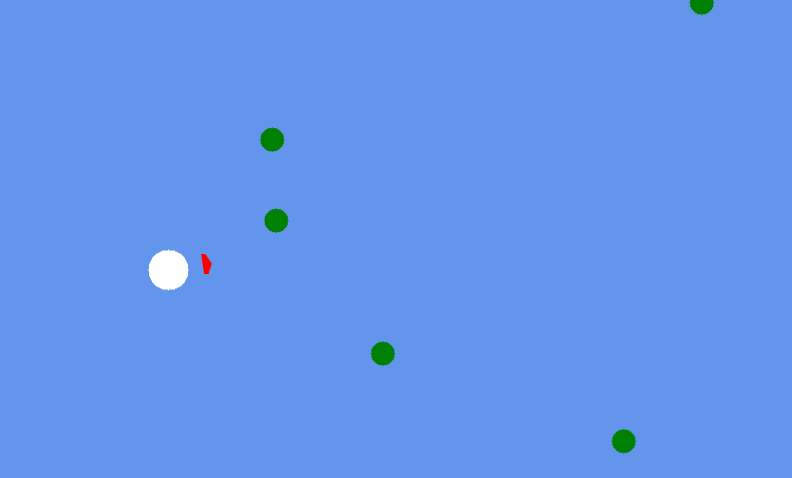

# BaseMonogameShooter

[](https://dotnet.microsoft.com/download/dotnet/8.0)
[](https://www.monogame.net/)

**BaseMonogameShooter** — это минималистичная 2D-аркада, созданная с использованием MonoGame. Игрок управляет круглым персонажем, который движется по экрану, стреляет пулями из орбитального оружия, ориентированного на курсор, и уничтожает врагов, появляющихся с краёв экрана. Проект демонстрирует базовые игровые механики, модульную архитектуру и является отличной основой для дальнейших экспериментов с MonoGame.

## Особенности
- **Геймплей**: Управляйте игроком (WASD, ускорение Shift), стреляйте пулями (левая кнопка мыши) и уничтожайте врагов.
- **Орбитальное оружие**: Красный треугольник вращается вокруг игрока, следуя за курсором, с уникальной механикой инверсии направления пуль при близком наведении.
- **Враги**: Зелёные круги появляются каждые 0.5 секунды, движутся к игроку и исчезают при столкновении или попадании пули.
- **Программные текстуры**: Все визуальные элементы (игрок, оружие, пули, враги) создаются кодом, без внешних ассетов.
- **Модульная архитектура**: Код организован с использованием принципов чистой архитектуры, готов к расширению (новые враги, механики).

## Скриншоты


## Установка

### Требования
- [.NET 8.0 SDK](https://dotnet.microsoft.com/download/dotnet/8.0)
- [MonoGame 3.8.1](https://www.monogame.net/) (устанавливается через NuGet)
- IDE, например [JetBrains Rider](https://www.jetbrains.com/rider/) или Visual Studio
- Windows (для сборки под `win-x64`; другие платформы поддерживаются с изменениями)

### Шаги
1. **Клонируйте репозиторий**:
   ```bash
   git clone https://github.com/srmrkN/BaseMonogameShooter.git
   cd TestGame
   ```

2. **Восстановите зависимости**:
   ```bash
   dotnet restore
   ```

3. **Соберите проект**:
   ```bash
   dotnet build
   ```

4. **Запустите игру**:
   ```bash
   dotnet run
   ```

   Или откройте проект в Rider/Visual Studio и запустите (F5).

## Управление
- **W, A, S, D**: Движение игрока.
- **Left Shift**: Ускорение.
- **Левая кнопка мыши**: Стрельба пулями.
- **Escape**: Выход из игры.

## Структура проекта
Код организован в модульной структуре для удобства поддержки и расширения:

```
TestGame/
├── Core/
│   ├── Game1.cs              # Главный класс MonoGame
│   ├── GameConstants.cs      # Константы (скорости, радиусы)
│   └── InputHandler.cs       # Обработка ввода
├── Entities/
│   ├── GameEntity.cs         # Абстрактный базовый класс для сущностей
│   ├── Player.cs             # Игрок
│   ├── Weapon.cs             # Орбитальное оружие
│   ├── Bullet.cs             # Пуля
│   └── Enemy.cs              # Враг
├── Managers/
│   ├── BulletManager.cs      # Управление пулями
│   └── EnemyManager.cs       # Управление врагами
├── TestGame.csproj           # Файл проекта
```

- **Core**: Ядро игры и утилиты.
- **Entities**: Игровые объекты с позицией и текстурой.
- **Managers**: Логика управления коллекциями сущностей.

## Как внести вклад
1. Форкните репозиторий.
2. Создайте ветку для изменений:
   ```bash
   git checkout -b feature/your-feature
   ```
3. Внесите изменения и закоммитьте:
   ```bash
   git commit -m "Добавлена новая фича"
   ```
4. Отправьте в ваш форк:
   ```bash
   git push origin feature/your-feature
   ```
5. Создайте Pull Request в оригинальный репозиторий.

## Планы на будущее
- Добавить здоровье игрока и систему урона.
- Ввести разные типы врагов (быстрые, боссы).
- Добавить эффекты частиц для попаданий и взрывов.
- Реализовать UI (счёт, меню).
- Подключить звуки и музыку.
- Использовать спрайты для визуального улучшения.

## Лицензия
Этот проект распространяется под лицензией [MIT](LICENSE). Вы можете свободно использовать, изменять и распространять код.

## Контакты
Если у вас есть вопросы или предложения, создайте Issue в репозитории или свяжитесь через [michihikko@gmail.com](mailto:michihikko@gmail.com).

---

*Создано для практики и экспериментов с MonoGame. Вдохновляйтесь и улучшайте!*
